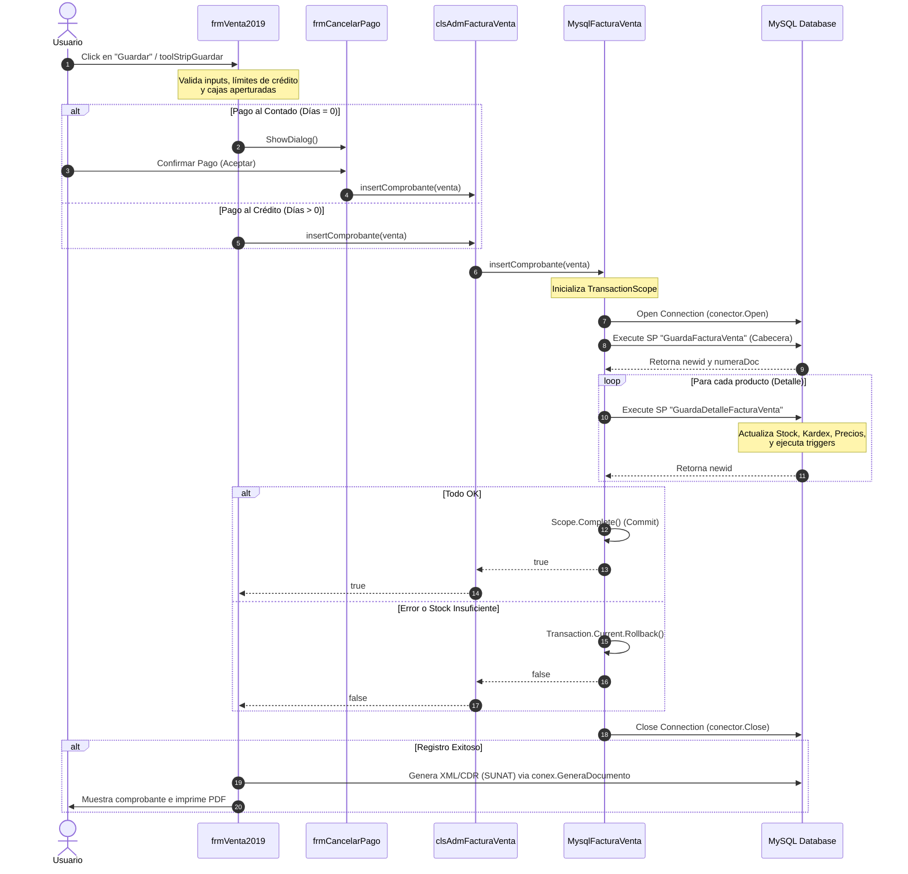

# Flujo de Cierre de Venta y Análisis de Cuello de Botella

Este documento detalla el flujo de código ejecutado para cerrar/guardar una venta en el sistema ERP **SIGEFA** y analiza la causa raíz del error `"se anuló la transacción"` cuando se procesan más de 20 productos.

---

## 1. Diagrama del Flujo de Cierre de Venta

A continuación se muestra el diagrama de secuencia que representa las llamadas entre capas cuando el usuario confirma la venta desde el formulario `frmVenta2019`.



---

## 2. Walkthrough del Código Involucrado

### Capa de Interfaz de Usuario (UI)

1. **[frmVenta2019.cs](file:///c:/Users/qemu/Documents/sigefa_legacy/SIGEFA.Formularios/frmVenta2019.cs)**:
   - **`guardaVenta()` (Línea ~3491)**: Es el punto de entrada principal. Se dispara al presionar el botón de guardar o mediante la tecla `F9`.
   - Recupera los datos de los almacenes y el carrito de compras (`RecorreDetalleVenta()`).
   - Si la forma de pago es **Al Crédito**, llama directamente a `AdmVenta.insertComprobante(this.venta)`.
   - Si es **Al Contado**, abre el formulario modal `frmCancelarPago` para capturar el pago.

2. **[frmCancelarPago.cs](file:///c:/Users/qemu/Documents/sigefa_legacy/SIGEFA.Formularios/frmCancelarPago.cs)**:
   - **`btnAceptar_Click()` (Línea ~613)** y **`Pagar()` (Línea ~1242)**:
   - Valida el método de pago y el efectivo recibido.
   - Si es una nueva venta (`venta.CodFacturaVenta == null`), llama a `AdmVenta.insertComprobante(venta)`.
   - Posteriormente registra el cobro en caja llamando a `Admpag.insert(Pag)`.

### Capa de Negocio (Business/Service)

- **[clsAdmFacturaVenta.cs](file:///c:/Users/qemu/Documents/sigefa_legacy/SIGEFA.Administradores/clsAdmFacturaVenta.cs)**:
  - **`insertComprobante(clsFacturaVenta venta)` (Línea ~32)**: Recibe el DTO `clsFacturaVenta` (que ya contiene los detalles en su lista `venta.Detalle`) y lo delega a la capa de datos (`Mventa.insertComprobante(venta)`). Maneja excepciones genéricas como llaves duplicadas.

### Capa de Acceso a Datos (DAL)

- **[MysqlFacturaVenta.cs](file:///c:/Users/qemu/Documents/sigefa_legacy/SIGEFA.InterMySql/MysqlFacturaVenta.cs)**:
  - **`insertComprobante(clsFacturaVenta factura_venta)` (Línea ~141)**:
    - Inicia un bloque `using TransactionScope Scope = new TransactionScope();`.
    - Abre la conexión mediante `con.conectarBD()`.
    - Ejecuta el procedimiento almacenado **`GuardaFacturaVenta`** para insertar la cabecera.
    - Itera sobre la lista `factura_venta.Detalle` de productos y, para cada uno, ejecuta el procedimiento almacenado **`GuardaDetalleFacturaVenta`** (Línea ~284).
    - Si todos se guardan de forma correcta, ejecuta `Scope.Complete()` para confirmar la transacción en la base de datos.
    - En el bloque `finally`, cierra la conexión de base de datos (`con.desconectarBD()`).

---

## 3. Identificación del Cuello de Botella y Causa Raíz

El error `"se anuló la transacción"` (`System.Transactions.TransactionAbortedException`) al superar los 20 productos es un síntoma clásico del uso de **`TransactionScope`** en .NET Framework combinado con accesos repetitivos a base de datos sobre redes lentas o servidores con alta concurrencia.

### Causa A: Exceso de Tiempo de Espera (Transaction Timeout)
1. **El Límite por Defecto**: Por defecto, un objeto `TransactionScope` en .NET tiene un tiempo de vida máximo de **60 segundos** (1 minuto).
2. **Latencia en Red y Ejecución del SP**: El servidor MySQL está configurado en una dirección de red privada (`192.168.1.129:3307`). Cada producto que se inserta requiere un viaje de ida y vuelta (round-trip) a la base de datos para ejecutar `GuardaDetalleFacturaVenta`.
3. **Costo del SP `GuardaDetalleFacturaVenta`**:
   - Inserta en la tabla de detalle.
   - Actualiza el stock en la tabla de almacén-producto.
   - Registra movimientos en la tabla Kardex.
   - Ejecuta triggers en base de datos para recalcular existencias o auditoría.
4. **Acumulación de Tiempo**: Si cada inserción de detalle tarda en promedio de 2.5 a 3 segundos (por bloqueos de filas en stock, triggers pesados o latencia de red), una venta de **20 productos tardará al menos 50-60 segundos**. Al pasar de 20 productos, el tiempo total supera el minuto de duración, lo que causa que el coordinador de transacciones de .NET **aborte automáticamente la transacción** antes de que pueda completarse.

### Causa B: Promoción a Transacción Distribuida (MSDTC)
1. El proveedor de MySQL para ADO.NET (`MySql.Data`) tiene problemas históricos al enlistar múltiples operaciones dentro de un `TransactionScope`.
2. Si por algún motivo se abre una conexión adicional (por ejemplo, dentro de algún trigger o procedimiento almacenado que involucre llamadas externas) o si el pool de conexiones abre conexiones paralelas en hilos concurrentes durante el procesamiento, .NET intenta promover la transacción local a una **Transacción Distribuida** administrada por el *Microsoft Distributed Transaction Coordinator* (MSDTC).
3. Como MySQL no soporta MSDTC de forma nativa a través del driver ADO.NET, la transacción falla instantáneamente y se aborta, dando como resultado el error `"se anuló la transacción"`.

---

## 4. Soluciones Recomendadas

### Opción 1: Incrementar el Timeout del `TransactionScope` (Solución Rápida)
Podemos modificar el constructor de `TransactionScope` en `MysqlFacturaVenta.cs` para darle un tiempo límite más alto (ej. 5 minutos). 

*Ubicación: [MysqlFacturaVenta.cs](file:///c:/Users/qemu/Documents/sigefa_legacy/SIGEFA.InterMySql/MysqlFacturaVenta.cs#L144)*:
```diff
-using TransactionScope Scope = new TransactionScope();
+TransactionOptions options = new TransactionOptions();
+options.Timeout = TimeSpan.FromMinutes(5);
+using TransactionScope Scope = new TransactionScope(TransactionScopeOption.Required, options);
```

### Opción 2: Cambiar a Transacciones Nativas de MySQL (`MySqlTransaction`) (Recomendada)
La mejor práctica al trabajar con MySQL en .NET es evitar `TransactionScope` por completo debido a su alto consumo de recursos y propensión a fallas de MSDTC. En su lugar, se deben usar transacciones nativas asociadas al objeto `MySqlConnection`.

Esto es mucho más rápido y evita cualquier limitación de coordinadores externos de transacciones de Windows:

```csharp
public bool insertComprobante(clsFacturaVenta factura_venta)
{
    bool rpta = true;
    con.conectarBD();
    // Iniciar transacción nativa en la conexión abierta
    using MySqlTransaction transaction = con.conector.BeginTransaction();
    try
    {
        cmd = new MySqlCommand("GuardaFacturaVenta", con.conector);
        cmd.Transaction = transaction; // Asociar transacción
        cmd.CommandType = CommandType.StoredProcedure;
        // ... set parameters ...
        cmd.ExecuteNonQuery();
        
        // ...
        
        foreach (clsDetalleFacturaVenta det in factura_venta.Detalle)
        {
            cmd = new MySqlCommand("GuardaDetalleFacturaVenta", con.conector);
            cmd.Transaction = transaction; // Asociar transacción
            cmd.CommandType = CommandType.StoredProcedure;
            // ... set parameters ...
            cmd.ExecuteNonQuery();
            // ...
        }
        
        if (rpta)
        {
            transaction.Commit(); // Confirmar cambios en DB
        }
        else
        {
            transaction.Rollback();
        }
        return rpta;
    }
    catch (MySqlException ex)
    {
        transaction.Rollback(); // Deshacer cambios
        throw ex;
    }
    finally
    {
        con.desconectarBD();
    }
}
```

### Opción 3: Optimización del Lado de la Base de Datos
* **Índices**: Asegurarse de que las tablas involucradas en `GuardaDetalleFacturaVenta` (como `detallefacturaventa`, `almacenproducto`, `kardex`) tengan índices adecuados en las llaves foráneas (`codproducto`, `codalmacen`, `codventa`).
* **Triggers**: Analizar y optimizar los triggers asociados a las inserciones en la tabla de detalles, ya que suelen ser la principal causa de lentitud al actualizar saldos históricos o stocks de forma ineficiente.
