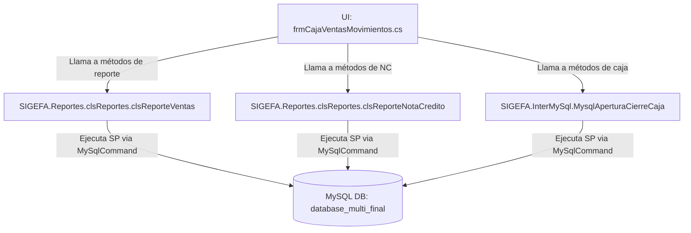

# Documentación Técnica: Cuadre de Caja y Reportes PDF en Movimientos de Caja

## 1. Visión General

El reporte de **Cuadre de Caja** (y el **Resumen de Ventas**) en PDF se genera en la ventana **`frmCajaVentasMovimientos.cs`** ([frmCajaVentasMovimientos.cs](file:///c:/Users/qemu/Documents/sigefa_legacy/SIGEFA.Formularios/frmCajaVentasMovimientos.cs)).

En la barra de herramientas superior (RibbonBar `ribbonBar1`), existen dos botones principales encargados de exportar la información del día a documentos PDF utilizando la librería `iTextSharp`:

1. **`buttonItem3` ("Cuadre de caja")**: Ejecuta `buttonItem3_Click` (líneas 1093–2273). Genera un reporte PDF completo de Cuadre de CajaDiario (`Venta_diaria_DD-MM-YYYY.pdf`), desglosado en 10 secciones matemáticas y comparativas entre almacenes de la misma ubicación.
2. **`buttonItem4` ("Resumen ventas")**: Ejecuta `buttonItem4_Click` (líneas 2274–2415). Genera un PDF consolidado de resumen de ventas y notas de crédito del día (`Resumen_ventasDD-MM-YYYY.pdf`).

---

## 2. Arquitectura y Capas Envolventes



---

## 3. Resumen de Procedimientos Almacenados (Stored Procedures) Utilizados

A continuación se listan todos los Stored Procedures llamados durante la construcción del PDF de Cuadre de Caja:

| Stored Procedure | Clase / Método C# Invocador | Descripción / Propósito |
| :--- | :--- | :--- |
| `ReporteVentasDiarioPdfCajaMovimiento` | `clsReporteVentas.ReporteDiarioPDF(fecha, codalma)` | Obtiene el detalle general de las ventas realizadas en el día por ubicación de almacén. |
| `ReporteNotasCreditosExcel` | `clsReporteNotaCredito.ReporteNotaCreditoDiaria(fecha, codalma)` | Obtiene el listado detallado de Notas de Crédito emitidas en el día. |
| `ReporteVentasDiarioExcelAgrup` | `clsReporteVentas.ReporteDiarioAgrupadosTotal(fecha, codalma)` | **Sección 1**: Ventas del día agrupadas por comprobante para calcular totales por almacén. |
| `LIstadoAlmacenXUbicacionExcel` | `clsReporteVentas.AlmacenXUbicacion(codalma)` | Recupera la lista de almacenes vinculados a la misma sede/ubicación para armar columnas dinámicas. |
| `ListaCajaChicaDiaria` | `MysqlAperturaCierreCaja.ListaCajaDiaria(...)` | Carga el grid `rgvMovimientosCajaChica` y filtra en C# para obtener **Sección 2** (`PAGOCAJA == 'PENDIENTE'`). |
| `ReporteVentasDiarioExcelPagosAgrup` | `clsReporteVentas.ReporteDiarioAgrupadoTotalPagos(fecha, codalma, codTipoPago)` | Agrupa ventas por forma de pago específica:<br>• `codTipoPago = 8`: **Sección 3** (Tarjetas / POS)<br>• `codTipoPago = 9`: **Sección 4** (Transferencias Bancarias)<br>• `codTipoPago = 6`: **Sección 5** (Descuentos Transportista / Depósitos) |
| `ReporteVentasCreditoDiarioExcel` | `clsReporteVentas.ReporteDiarioVentasCredito(fecha, codalma)` | **Sección 6**: Obtiene las ventas efectuadas al crédito (`formaPago <> 6`). |
| `ListaCajaEgresos` | `clsReporteVentas.ListaCajaEgresos(fecha, codalma, codsucur)` | **Sección 8**: Recupera los egresos o salidas de efectivo registradas en caja chica. |
| `ListaNotasCreditos` | `clsReporteVentas.ListaNotasCredito(fecha, codalma, codsucur)` | **Sección 9**: Notas de Crédito cobradas/devueltas en efectivo (`codTipoPago = 10`). |
| `ListaCajaIngresos` | `clsReporteVentas.ListaCajaIngresos(fecha, codalma, codsucur)` | **Sección 10**: Ingresos directos en efectivo a caja (`codTipoPago = 5`). |
| `ListaCajaIngresosTarjeta` | `clsReporteVentas.ListaCajaIngresosTarjeta(fecha, codalma, codsucur)` | Recupera otros ingresos abonados con tarjeta (`codTipoPago = 8`). |
| `ListaCajaIngresosTransferencia` | `clsReporteVentas.ListaCajaIngresosTransferencia(fecha, codalma, codsucur)` | Recupera otros ingresos abonados por transferencia (`codTipoPago = 9`). |

---

## 4. Estructura y Lógica del Cuadre de Caja PDF (`buttonItem3_Click`)

El reporte se genera en formato A4 Horizontal (PageSize.A4.Rotate) y consta de dos tablas principales:

### Tabla 1: Detalle General de Ventas y Notas de Crédito
1. **Encabezado**: Muestra el título `REPORTE DE VENTAS DEL DIA DD-MM-YYYY`.
2. **Listado de Ventas**: Obtenido mediante `ReporteVentasDiarioPdfCajaMovimiento`. Muestra la lista de comprobantes con sus ítems, precios unitarios, subtotales y suma total acumulada (`TOTAL VENTAS`).
3. **Listado de Notas de Crédito**: Obtenido mediante `ReporteNotaCreditoDiaria`. Muestra Fecha, N° NC, Documento de Referencia, Descripción del Ítem y Montos.

### Tabla 2: Cuadro de Cuadre Consolidado por Almacén y Liquidación
Se construyen dinámicamente columnas por cada almacén perteneciente a la misma ubicación (usando `LIstadoAlmacenXUbicacionExcel`):

1. **Sección 1: TOTAL VENTAS**: Sumatoria de ventas agrupadas activas (`ReporteVentasDiarioExcelAgrup`).
2. **Sección 2: TOTAL PENDIENTES**: Sumatoria de créditos pendientes filtrados del grid de la caja (`rgvMovimientosCajaChica` donde `PAGOCAJA == 'PENDIENTE'`).
3. **Sección 3: TOTAL VENTAS CON TARJETA**: Sumatoria de cobros con Tarjeta / POS (`ReporteVentasDiarioExcelPagosAgrup` con `codTipoPago = 8`). Muestra monto neto y valor bruto recalculado al 96% (`/ 0.96`).
4. **Sección 4: TOTAL VENTAS CON TRANSFERENCIA**: Sumatoria de cobros por Transferencia (`ReporteVentasDiarioExcelPagosAgrup` con `codTipoPago = 9`).
5. **Sección 5: TOTAL DESCUENTOS TRANSPORTISTA**: Sumatoria de pagos vía depósito (`ReporteVentasDiarioExcelPagosAgrup` con `codTipoPago = 6`).
6. **Sección 6: TOTAL DESCUENTOS A CREDITO**: Sumatoria de ventas a crédito (`ReporteVentasCreditoDiarioExcel`).
7. **Sección 7: TOTAL V. CONTADO (1-6)**: Fómula en C#:
   $$\text{Total Contado} = \text{Total Ventas [1]} - \text{Total Crédito [6]}$$
8. **Sección 8: TOTAL EGRESOS CAJA**: Salidas de caja obtenidas mediante `ListaCajaEgresos`.
9. **Sección 9: NOTAS DE CREDITO COBRADAS**: Salidas/cobros por notas de crédito obtenidas mediante `ListaNotasCreditos`.
10. **Sección 10: TOTAL INGRESOS EFECTIVO**: Ingresos en efectivo en caja chica mediante `ListaCajaIngresos`.
11. **TOTAL A DEPOSITAR**: Fórmula matemática ejecutada al final de la tabla:
   $$\text{Total Depositar} = \text{Sec 7 (Contado)} - \text{Sec 2} - \text{Sec 3} - \text{Sec 4} - \text{Sec 5} - \text{Sec 8} - \text{Sec 9} + \text{Sec 10}$$
12. **Resumen POS e Ingresos Adicionales**:
    - **Total Ingresos Tarjeta**: Mediante `ListaCajaIngresosTarjeta`.
    - **Total POS Total**: `(Ventas Tarjetas + Ingresos Tarjetas) / 0.96`.
    - **Total Ingresos Transferencia**: Mediante `ListaCajaIngresosTransferencia`.

---

## 5. Código SQL Completo de los Stored Procedures

A continuación se muestra la definición SQL exacta de cada procedimiento almacenado obtenido directamente del servidor MySQL:

### 1. `ReporteVentasDiarioPdfCajaMovimiento`
```sql
CREATE DEFINER=`root`@`%` PROCEDURE `ReporteVentasDiarioPdfCajaMovimiento`(IN `fecha` datetime, IN `codalma` int)
BEGIN
	select 
		fv.fecharegistro as fecha,
		IF(td.descripcion="BOLETA DE VENTA","BOLETA",td.descripcion) AS doc,
		CONCAT(fv.serie,"-",LPAD(fv.numDocumento,8,"0")) as num_doc,
		cli.nombre as cliente,
		dfv.cantidad,
		CONCAT(pro.referencia," - ",(um.descripcion)," - ",pro.descripcion) as descripcion,
		dfv.preciounitario,
		dfv.subtotal,
		fv.total,
		if(fv.formapago<>6,fp.descripcion,(select GROUP_CONCAT(DISTINCT((
																	SELECT mp.descripcion from metodopago mp where mp.codMetodoPago = p.codTipoPago
																))) 
			from pago p where p.codNota = fv.codFacturaV and p.estado=1 GROUP BY p.codnota)) as metodos_pagos,
		fv.codAlmacen as almacen,
		(select almacen.descripcion from almacen where almacen.codAlmacen = fv.codAlmacen) as nom_alm,
		(SELECT CASE fv.anulado WHEN 0 THEN "ACTIVO" WHEN 1 THEN (if((select count(*) from repositorio where codfacturaventa=fv.codfacturav)>0 and fv.codnotacredito>0,"ACTIVO CON NC","ANULADO"))END) AS anulado,
		p.color,
		dfv.codproducto,
		fv.codFacturaV
	from factura_venta fv
	left JOIN formapago fp ON fp.codFormaPago = fv.formapago
	inner join detallefactura_venta dfv on dfv.codFacturaV = fv.codFacturaV
	inner join producto pro on dfv.codProducto = pro.codProducto
	inner join unidadmedida um on dfv.unidadingresada = um.codUnidadMedida
	inner join tipodocumento td on td.codTipoDocumento = fv.codTipoDocumento
	inner join cliente cli on cli.codCliente = fv.codCliente
	LEFT join pago p on p.codNota =fv.codFacturaV
	where date(fv.fecharegistro) = date(fecha)
	and (fv.codAlmacen in (select a.codalmacen from almacen a where a.ubicacion = (select ubicacion from almacen where codalmacen = codalma)))
	GROUP BY fv.codFacturaV
	order by fv.fecharegistro asc;
END
```

### 2. `ReporteNotasCreditosExcel`
```sql
CREATE DEFINER=`root`@`%` PROCEDURE `ReporteNotasCreditosExcel`(IN `fecha` datetime,IN `codalma` int)
BEGIN
select 
		date(nc.fecharegistro) as fecha_nota_credito,
		CONCAT("NC",nc.serie,"-",LPAD(nc.DocumentoFactura,8,"0")) as "num_doc_nota_credito",
		date(fv.fecharegistro) as fecha_doc_ref,
		CONCAT(IF(td.descripcion="BOLETA DE VENTA","B",
								IF(td.descripcion="FACTURA","F",td.descripcion)),fv.serie,"-",LPAD(fv.numDocumento,8,"0")) 
		as "num_doc_ref",
		(case tnc.codigosunat when "07" then "PARCIAL" else "TOTAL" end) as tipo_pago,
		dnc.cantidad,
		CONCAT(pro.referencia," - ",(um.descripcion)," - ",pro.descripcion) as descripcion,
		dnc.preciounitario,
		dnc.subtotal,
		(select SUM(dnc1.subtotal) from detallenotacredito dnc1 where dnc1.codNotaCredito = dnc.codNotaCredito) as total,
		nc.codalmacen as almacen
FROM notacredito nc
inner join factura_venta fv on fv.codFacturaV = nc.codReferencia
inner join tipodocumento td on td.codTipoDocumento = fv.codTipoDocumento
inner join detallenotacredito dnc on dnc.codNotaCredito = nc.codNotaCredito
inner join producto pro on dnc.codProducto = pro.codProducto
inner join unidadmedida um on dnc.unidadIngresada = um.codUnidadMedida
INNER JOIN tipo_nota_credito tnc on tnc.codigosunat = nc.motivo
where (nc.codTransaccion = 20 or nc.codTransaccion = 17) and date(nc.fecharegistro) = date(fecha)
	and nc.codAlmacen in (select a.codalmacen from almacen a where a.ubicacion = (select ubicacion from almacen where codalmacen = codalma))
order by nc.fecharegistro asc;
END
```

### 3. `ReporteVentasDiarioExcelAgrup`
```sql
CREATE DEFINER=`root`@`%` PROCEDURE `ReporteVentasDiarioExcelAgrup`(IN `fecha` datetime, IN `codalma` int)
BEGIN
	select 
		date(fv.fecharegistro) as fecha,
		IF(td.descripcion="BOLETA DE VENTA","BOLETA",td.descripcion) AS doc,
		CONCAT((case td.descripcion
				when "BOLETA DE VENTA" then "B"
				when "FACTURA" then "F"
				else td.sigla end),fv.serie,"-",LPAD(fv.numDocumento,8,"0")) as "num_doc",
		cli.nombre as cliente,
		dfv.cantidad,
		pro.descripcion as descripcion,
		dfv.preciounitario,
		dfv.subtotal,
		fv.total,
		(select GROUP_CONCAT(DISTINCT((
																	SELECT mp.descripcion from metodopago mp where mp.codMetodoPago = p.codTipoPago
																))) 
			from pago p where p.codNota = fv.codFacturaV GROUP BY p.codnota) as metodos_pagos,
		fv.codAlmacen as almacen,
		(SELECT CASE fv.anulado WHEN 0 THEN "ACTIVO" WHEN 1 THEN (if((select count(*) from repositorio where codfacturaventa=fv.codfacturav)>0 and fv.codnotacredito>0,"ACTIVO CON NC","ANULADO"))END) AS v_anulado
	from factura_venta fv
	inner join detallefactura_venta dfv on dfv.codFacturaV = fv.codFacturaV
	inner join producto pro on dfv.codProducto = pro.codProducto
	inner join tipodocumento td on td.codTipoDocumento = fv.codTipoDocumento
	inner join cliente cli on cli.codCliente = fv.codCliente
	where date(fv.fecharegistro) = date(fecha)
	and fv.codAlmacen in (select a.codalmacen from almacen a where a.ubicacion = (select ubicacion from almacen where codalmacen = codalma))
	and fv.anulado = 0
	GROUP BY num_doc	
	order by fv.fecharegistro asc;
END
```

### 4. `LIstadoAlmacenXUbicacionExcel`
```sql
CREATE DEFINER=`root`@`%` PROCEDURE `LIstadoAlmacenXUbicacionExcel`(`codalma` int)
BEGIN
		select 
			a.codalmacen,
			SUBSTR(a.descripcion,9,6) as descripcion  
		from almacen a where a.ubicacion = (select ubicacion from almacen where codalmacen = codalma)
		order by a.codalmacen asc;
END
```

### 5. `ReporteVentasDiarioExcelPagosAgrup`
```sql
CREATE DEFINER=`root`@`%` PROCEDURE `ReporteVentasDiarioExcelPagosAgrup`(IN `fecha` datetime, IN `codalma` int,IN `codTipoPago` int)
BEGIN
	select 
		date(fv.fecharegistro) as fecha,
		IF(td.descripcion="BOLETA DE VENTA","BOLETA",td.descripcion) AS doc,
		CONCAT(
			(case td.descripcion
				when "BOLETA DE VENTA" then "B"
				when "FACTURA" then "F"
				else td.sigla end)
		,fv.serie,"-",LPAD(fv.numDocumento,8,"0")) as "num_doc",
		cli.nombre as cliente,
		dfv.cantidad,
		pro.descripcion as descripcion,
		dfv.preciounitario,
		dfv.subtotal,
		fv.total,
		mp.descripcion as metodos_pagos,
		fv.codAlmacen as almacen,
		p.montopagado,
		(SELECT CASE fv.anulado 
									WHEN 0 THEN "ACTIVO" 
									WHEN 1 THEN (if((select count(*) from repositorio where codfacturaventa=fv.codfacturav)>0 and fv.codnotacredito>0,"ACTIVO CON NC","ANULADO"))END) AS v_anulado,
									(select sigla from banco where codBanco = p.codBanco) as banco,
		p.numctacte,
		p.color
	from factura_venta fv
	inner join pago p on p.codNota = fv.codFacturaV
	inner join metodopago mp on mp.codMetodoPago = p.codTipoPago
	inner join detallefactura_venta dfv on dfv.codFacturaV = fv.codFacturaV
	inner join producto pro on dfv.codProducto = pro.codProducto
	inner join tipodocumento td on td.codTipoDocumento = fv.codTipoDocumento
	inner join cliente cli on cli.codCliente = fv.codCliente
	where date(fv.fecharegistro) = date(fecha)
	and fv.codAlmacen in (select a.codalmacen from almacen a where a.ubicacion = (select ubicacion from almacen where codalmacen = codalma))
	and p.codTipoPago = codTipoPago and p.estado=1
	GROUP BY fv.codFacturaV,p.codPago
	order by fv.fecharegistro asc;
END
```

### 6. `ReporteVentasCreditoDiarioExcel`
```sql
CREATE DEFINER=`root`@`%` PROCEDURE `ReporteVentasCreditoDiarioExcel`(IN `fecha` datetime, IN `codalma` int)
BEGIN
	select 
		date(fv.fecharegistro) as fecha,
		IF(td.descripcion="BOLETA DE VENTA","BOLETA",td.descripcion) AS doc,
		CONCAT((case td.descripcion
				when "BOLETA DE VENTA" then "B"
				when "FACTURA" then "F"
				else td.sigla end),fv.serie,"-",LPAD(fv.numDocumento,8,"0")) as "num_doc",
		cli.nombre as cliente,
		dfv.cantidad,
		pro.descripcion as descripcion,
		dfv.preciounitario,
		dfv.subtotal,
		fv.total,
		(select GROUP_CONCAT(DISTINCT((
																	SELECT mp.descripcion from metodopago mp where mp.codMetodoPago = p.codTipoPago
																))) 
			from pago p where p.codNota = fv.codFacturaV GROUP BY p.codnota) as metodos_pagos,
		fv.codAlmacen as almacen,
		(select almacen.descripcion from almacen where almacen.codAlmacen = fv.codAlmacen) as nom_alm,
		fv.formaPago as codFormaPago, 
		(select fp.descripcion from formapago fp where fp.codFormaPago = fv.formapago) as FormaPago,
		(SELECT CASE fv.anulado WHEN 0 THEN "ACTIVO" WHEN 1 THEN (if((select count(*) from repositorio where codfacturaventa=fv.codfacturav)>0 and fv.codnotacredito>0,"ACTIVO CON NC","ANULADO"))END) AS v_anulado
	from factura_venta fv
	inner join detallefactura_venta dfv on dfv.codFacturaV = fv.codFacturaV
	inner join producto pro on dfv.codProducto = pro.codProducto
	inner join tipodocumento td on td.codTipoDocumento = fv.codTipoDocumento
	inner join cliente cli on cli.codCliente = fv.codCliente
	where date(fv.fecharegistro) = date(fecha)
	and fv.codAlmacen in (select a.codalmacen from almacen a where a.ubicacion = (select ubicacion from almacen where codalmacen = codalma))
	and fv.formapago <> 6
	GROUP BY num_doc
	order by fv.fecharegistro asc;
END
```

### 7. `ListaCajaEgresos`
```sql
CREATE DEFINER=`root`@`%` PROCEDURE `ListaCajaEgresos`(codSucur int(11), fecha1 date, codalma int(11))
BEGIN
	SELECT p.tipo_descripcion_ingreso, cm.codMovCaja, cm.codSucursal, cm.codcaja, IFNULL(cm.codPago,0) as codPago,
	       (p.observacion) AS concepto, die.descripcion, (FORMAT(cm.monto,2)) AS monto, cm.tipo,  
	       (CASE cm.tipo WHEN 1 THEN "INGRESO" WHEN 2 THEN "EGRESO" END) AS ingresoegreso, 
	       cm.tipomovimiento, cm.fecharegistro, cm.tipodocumento, 
	       IFNULL((SELECT sigla FROM tipodocumento WHERE codTipoDocumento = cm.tipodocumento),"") AS documento, 
	       cm.codSerie, cm.serie, 
	       if(cm.codTipoPagoCaja=10, 
	          (select concat("NC", nc.serie,"-",LPAD(nc.DocumentoFactura,8,'0')) from notacredito nc where nc.codNotaI=p.codnotacredito),
	          CONCAT(IFNULL((SELECT sigla FROM tipodocumento WHERE codTipoDocumento = cm.tipodocumento),""), " ", cm.serie, "-", LPAD(cm.codPago,9,0))) AS NumDocumento,
	       (CASE p.ingresoegreso WHEN 0 THEN ifnull((select prov1.razonsocial from facturacion fact inner join proveedor prov1 on prov1.codProveedor = fact.codProveedor where fact.codFactura = p.codNota),"---------") ELSE ifnull(cl.nombre,"--------") END) as nomcli,
	       (CASE p.ingresoegreso WHEN 0 THEN ifnull((select prov1.ruc from facturacion fact inner join proveedor prov1 on prov1.codProveedor = fact.codProveedor where fact.codFactura = p.codNota),"---------") ELSE (case cl.ruc when null then ifnull(cl.dni,"--------") when "" then ifnull(cl.dni,"--------") else ifnull(cl.ruc,"--------") end) END) as doccli,
	       (CASE cm.tipo WHEN 1 THEN IFNULL((SELECT CONCAT((SELECT t.sigla FROM tipodocumento t WHERE t.codTipoDocumento = ns.codTipoDocumento), " ", ns.serie, " - ", LPAD(ns.numDocumento,8,0)) FROM pago p INNER JOIN factura_venta ns on ns.codFacturaV = p.codNota WHERE p.codPago = cm.codPago), (SELECT CONCAT((SELECT t.sigla FROM tipodocumento t WHERE t.codTipoDocumento = p.codTipoDocumento ), " ", p.serie, " - ", LPAD(p.numdocumento,8,0)) FROM pago p WHERE p.codPago = cm.codPago)) WHEN 2 THEN IFNULL((SELECT ni.DocumentoFactura FROM pago p INNER JOIN facturacion ni on ni.codFactura = p.codNota WHERE p.codPago = cm.codPago),"") END) AS documentorefencia, 
	       0 AS SALDO, cm.estado, p.codAlmacen	
	FROM caja c
	INNER JOIN cajamovimiento cm ON cm.codcaja = c.codcaja
	left outer join pago p on p.codpago=cm.codpago
	INNER JOIN descripcion_ingreso_egreso die ON p.tipo_descripcion_ingreso = die.id
	left outer join factura_venta fv on fv.codfacturav=p.codnota
	left outer join cliente cl on cl.codcliente=fv.codcliente
	left outer join proveedor prov on prov.codProveedor = fv.codcliente
	left outer join tarjetaspago tp on tp.codtarjeta=p.codtarjetaspago
	WHERE p.codNota = 0 and p.notacredito =0 and p.ingresoegreso = 0 and p.codTipoDocumento !=0 and c.codsucursal in (select codsucursal from almacen where codsucursal in (select codsucursal from almacen a where substring(nombre from 1 for locate('-',nombre)) in (select substring(a.nombre from 1 for locate('-',a.nombre)) from almacen a where codsucursal=codSucur)))
	AND DATE(c.fechaapertura) = DATE(fecha1)
	AND c.codalmacen in (select codalmacen from almacen where codsucursal in (select codsucursal from almacen a where substring(nombre from 1 for locate('-',nombre)) in (select substring(a.nombre from 1 for locate('-',a.nombre)) from almacen a where codsucursal=codSucur)))
	AND cm.tipodocumento <> 7 
	AND cm.estado=1
	ORDER BY cm.codmovcaja asc;
END
```

### 8. `ListaNotasCreditos`
```sql
CREATE DEFINER=`root`@`%` PROCEDURE `ListaNotasCreditos`(codSucur int(11), fecha1 date, codalma int(11))
BEGIN
	SELECT p.tipo_descripcion_ingreso, cm.codMovCaja, cm.codSucursal, cm.codcaja, IFNULL(cm.codPago,0) as codPago,
	       (p.observacion) AS concepto, FORMAT(cm.monto,2) AS monto, cm.tipo,  
	       (CASE cm.tipo WHEN 1 THEN "INGRESO" WHEN 2 THEN "EGRESO" END) AS ingresoegreso, 
	       cm.tipomovimiento, cm.fecharegistro, cm.tipodocumento, 
	       IFNULL((SELECT sigla FROM tipodocumento WHERE codTipoDocumento = cm.tipodocumento),"") AS documento, 
	       cm.codSerie, cm.serie, 
	       if(cm.codTipoPagoCaja=10, 
	          (select concat("NC", nc.serie,"-",LPAD(nc.DocumentoFactura,8,'0')) from notacredito nc where nc.codNotaI=p.codnotacredito),
	          CONCAT(IFNULL((SELECT sigla FROM tipodocumento WHERE codTipoDocumento = cm.tipodocumento),""), " ", cm.serie, "-", LPAD(cm.codPago,9,0))) AS NumDocumento,
	       (CASE p.ingresoegreso WHEN 0 THEN ifnull((select prov1.razonsocial from facturacion fact inner join proveedor prov1 on prov1.codProveedor = fact.codProveedor where fact.codFactura = p.codNota),"---------") ELSE ifnull(cl.nombre,"--------") END) as nomcli,
	       (CASE p.ingresoegreso WHEN 0 THEN ifnull((select prov1.ruc from facturacion fact inner join proveedor prov1 on prov1.codProveedor = fact.codProveedor where fact.codFactura = p.codNota),"---------") ELSE (case cl.ruc when null then ifnull(cl.dni,"--------") when "" then ifnull(cl.dni,"--------") else ifnull(cl.ruc,"--------") end) END) as doccli,
	       (CASE cm.tipo WHEN 1 THEN IFNULL((SELECT CONCAT((SELECT t.sigla FROM tipodocumento t WHERE t.codTipoDocumento = ns.codTipoDocumento), " ", ns.serie, " - ", LPAD(ns.numDocumento,8,0)) FROM pago p INNER JOIN factura_venta ns on ns.codFacturaV = p.codNota WHERE p.codPago = cm.codPago), (SELECT CONCAT((SELECT t.sigla FROM tipodocumento t WHERE t.codTipoDocumento = p.codTipoDocumento ), " ", p.serie, " - ", LPAD(p.numdocumento,8,0)) FROM pago p WHERE p.codPago = cm.codPago)) WHEN 2 THEN IFNULL((SELECT ni.DocumentoFactura FROM pago p INNER JOIN facturacion ni on ni.codFactura = p.codNota WHERE p.codPago = cm.codPago),"") END) AS documentorefencia, 
	       0 AS SALDO, cm.estado, p.codAlmacen	
	FROM caja c
	INNER JOIN cajamovimiento cm ON cm.codcaja = c.codcaja
	left outer join pago p on p.codpago=cm.codpago
	left outer join factura_venta fv on fv.codfacturav=p.codnota
	left outer join cliente cl on cl.codcliente=fv.codcliente
	left outer join proveedor prov on prov.codProveedor = fv.codcliente
	left outer join tarjetaspago tp on tp.codtarjeta=p.codtarjetaspago
	WHERE p.codNota != 0 and p.notacredito != 0 and p.ingresoegreso = 1 and p.codTipoDocumento !=0 and p.codTipoPago =10 and c.codsucursal in (select codsucursal from almacen where codsucursal in (select codsucursal from almacen a where substring(nombre from 1 for locate('-',nombre)) in (select substring(a.nombre from 1 for locate('-',a.nombre)) from almacen a where codsucursal=codSucur)))
	AND DATE(c.fechaapertura) = DATE(fecha1)
	AND c.codalmacen in (select codalmacen from almacen where codsucursal in (select codsucursal from almacen a where substring(nombre from 1 for locate('-',nombre)) in (select substring(a.nombre from 1 for locate('-',a.nombre)) from almacen a where codsucursal=codSucur)))
	AND cm.tipodocumento <> 7 
	AND cm.estado=1 and p.opcionSuma = 1
	ORDER BY cm.codmovcaja asc;
END
```

### 9. `ListaCajaIngresos`
```sql
CREATE DEFINER=`root`@`%` PROCEDURE `ListaCajaIngresos`(codSucur int(11), fecha1 date, codalma int(11))
BEGIN
	SELECT p.tipo_descripcion_ingreso, cm.codMovCaja, cm.codSucursal, cm.codcaja, IFNULL(cm.codPago,0) as codPago,
	       (p.observacion) AS concepto, die.descripcion, (FORMAT(cm.monto,2)) AS monto, cm.tipo,  
	       (CASE cm.tipo WHEN 1 THEN "INGRESO" WHEN 2 THEN "EGRESO" END) AS ingresoegreso, 
	       cm.tipomovimiento, cm.fecharegistro, cm.tipodocumento, 
	       IFNULL((SELECT sigla FROM tipodocumento WHERE codTipoDocumento = cm.tipodocumento),"") AS documento, 
	       cm.codSerie, cm.serie, 
	       if(cm.codTipoPagoCaja=10, 
	          (select concat("NC", nc.serie,"-",LPAD(nc.DocumentoFactura,8,'0')) from notacredito nc where nc.codNotaI=p.codnotacredito),
	          CONCAT(IFNULL((SELECT sigla FROM tipodocumento WHERE codTipoDocumento = cm.tipodocumento),""), " ", cm.serie, "-", LPAD(cm.codPago,9,0))) AS NumDocumento,
	       (CASE p.ingresoegreso WHEN 0 THEN ifnull((select prov1.razonsocial from facturacion fact inner join proveedor prov1 on prov1.codProveedor = fact.codProveedor where fact.codFactura = p.codNota),"---------") ELSE ifnull(cl.nombre,"--------") END) as nomcli,
	       (CASE p.ingresoegreso WHEN 0 THEN ifnull((select prov1.ruc from facturacion fact inner join proveedor prov1 on prov1.codProveedor = fact.codProveedor where fact.codFactura = p.codNota),"---------") ELSE (case cl.ruc when null then ifnull(cl.dni,"--------") when "" then ifnull(cl.dni,"--------") else ifnull(cl.ruc,"--------") end) END) as doccli,
	       (CASE cm.tipo WHEN 1 THEN IFNULL((SELECT CONCAT((SELECT t.sigla FROM tipodocumento t WHERE t.codTipoDocumento = ns.codTipoDocumento), " ", ns.serie, " - ", LPAD(ns.numDocumento,8,0)) FROM pago p INNER JOIN factura_venta ns on ns.codFacturaV = p.codNota WHERE p.codPago = cm.codPago), (SELECT CONCAT((SELECT t.sigla FROM tipodocumento t WHERE t.codTipoDocumento = p.codTipoDocumento ), " ", p.serie, " - ", LPAD(p.numdocumento,8,0)) FROM pago p WHERE p.codPago = cm.codPago)) WHEN 2 THEN IFNULL((SELECT ni.DocumentoFactura FROM pago p INNER JOIN facturacion ni on ni.codFactura = p.codNota WHERE p.codPago = cm.codPago),"") END) AS documentorefencia, 
	       0 AS SALDO, cm.estado, p.codAlmacen, p.color	
	FROM caja c
	INNER JOIN cajamovimiento cm ON cm.codcaja = c.codcaja
	left outer join pago p on p.codpago=cm.codpago
	INNER JOIN descripcion_ingreso_egreso die ON p.tipo_descripcion_ingreso = die.id
	left outer join factura_venta fv on fv.codfacturav=p.codnota
	left outer join cliente cl on cl.codcliente=fv.codcliente
	left outer join proveedor prov on prov.codProveedor = fv.codcliente
	left outer join tarjetaspago tp on tp.codtarjeta=p.codtarjetaspago
	WHERE p.codNota = 0 and p.notacredito =0 and p.ingresoegreso = 1 and p.codTipoDocumento !=0 and c.codsucursal in (select codsucursal from almacen where codsucursal in (select codsucursal from almacen a where substring(nombre from 1 for locate('-',nombre)) in (select substring(a.nombre from 1 for locate('-',a.nombre)) from almacen a where codsucursal=codSucur)))
	AND DATE(c.fechaapertura) = DATE(fecha1)
	AND c.codalmacen in (select codalmacen from almacen where codsucursal in (select codsucursal from almacen a where substring(nombre from 1 for locate('-',nombre)) in (select substring(a.nombre from 1 for locate('-',a.nombre)) from almacen a where codsucursal=codSucur)))
	AND p.codTipoPago = 5 
	AND cm.estado=1
	ORDER BY cm.codmovcaja asc;
END
```

### 10. `ListaCajaIngresosTarjeta`
```sql
CREATE DEFINER=`root`@`%` PROCEDURE `ListaCajaIngresosTarjeta`(codSucur int(11), fecha1 date, codalma int(11))
BEGIN
	SELECT p.tipo_descripcion_ingreso, cm.codMovCaja, cm.codSucursal, cm.codcaja, IFNULL(cm.codPago,0) as codPago,
	       (p.observacion) AS concepto, die.descripcion, (FORMAT(cm.monto,2)) AS monto, cm.tipo,  
	       (CASE cm.tipo WHEN 1 THEN "INGRESO" WHEN 2 THEN "EGRESO" END) AS ingresoegreso, 
	       cm.tipomovimiento, cm.fecharegistro, cm.tipodocumento, 
	       IFNULL((SELECT sigla FROM tipodocumento WHERE codTipoDocumento = cm.tipodocumento),"") AS documento, 
	       cm.codSerie, cm.serie, 
	       if(cm.codTipoPagoCaja=10, 
	          (select concat("NC", nc.serie,"-",LPAD(nc.DocumentoFactura,8,'0')) from notacredito nc where nc.codNotaI=p.codnotacredito),
	          CONCAT(IFNULL((SELECT sigla FROM tipodocumento WHERE codTipoDocumento = cm.tipodocumento),""), " ", cm.serie, "-", LPAD(cm.codPago,9,0))) AS NumDocumento,
	       (CASE p.ingresoegreso WHEN 0 THEN ifnull((select prov1.razonsocial from facturacion fact inner join proveedor prov1 on prov1.codProveedor = fact.codProveedor where fact.codFactura = p.codNota),"---------") ELSE ifnull(cl.nombre,"--------") END) as nomcli,
	       (CASE p.ingresoegreso WHEN 0 THEN ifnull((select prov1.ruc from facturacion fact inner join proveedor prov1 on prov1.codProveedor = fact.codProveedor where fact.codFactura = p.codNota),"---------") ELSE (case cl.ruc when null then ifnull(cl.dni,"--------") when "" then ifnull(cl.dni,"--------") else ifnull(cl.ruc,"--------") end) END) as doccli,
	       (CASE cm.tipo WHEN 1 THEN IFNULL((SELECT CONCAT((SELECT t.sigla FROM tipodocumento t WHERE t.codTipoDocumento = ns.codTipoDocumento), " ", ns.serie, " - ", LPAD(ns.numDocumento,8,0)) FROM pago p INNER JOIN factura_venta ns on ns.codFacturaV = p.codNota WHERE p.codPago = cm.codPago), (SELECT CONCAT((SELECT t.sigla FROM tipodocumento t WHERE t.codTipoDocumento = p.codTipoDocumento ), " ", p.serie, " - ", LPAD(p.numdocumento,8,0)) FROM pago p WHERE p.codPago = cm.codPago)) WHEN 2 THEN IFNULL((SELECT ni.DocumentoFactura FROM pago p INNER JOIN facturacion ni on ni.codFactura = p.codNota WHERE p.codPago = cm.codPago),"") END) AS documentorefencia, 
	       0 AS SALDO, cm.estado, p.codAlmacen, (select sigla from banco where codBanco = p.codBanco) as banco, p.color	
	FROM caja c
	INNER JOIN cajamovimiento cm ON cm.codcaja = c.codcaja
	left outer join pago p on p.codpago=cm.codpago
	INNER JOIN descripcion_ingreso_egreso die ON p.tipo_descripcion_ingreso = die.id
	left outer join factura_venta fv on fv.codfacturav=p.codnota
	left outer join cliente cl on cl.codcliente=fv.codcliente
	left outer join proveedor prov on prov.codProveedor = fv.codcliente
	left outer join tarjetaspago tp on tp.codtarjeta=p.codtarjetaspago
	WHERE p.codNota = 0 and p.ingresoegreso = 1 and c.codsucursal in (select codsucursal from almacen where codsucursal in (select codsucursal from almacen a where substring(nombre from 1 for locate('-',nombre)) in (select substring(a.nombre from 1 for locate('-',a.nombre)) from almacen a where codsucursal=codSucur)))
	AND DATE(c.fechaapertura) = DATE(fecha1)
	AND c.codalmacen in (select codalmacen from almacen where codsucursal in (select codsucursal from almacen a where substring(nombre from 1 for locate('-',nombre)) in (select substring(a.nombre from 1 for locate('-',a.nombre)) from almacen a where codsucursal=codSucur)))
	AND p.codTipoPago = 8 
	AND cm.estado=1
	ORDER BY cm.codmovcaja asc;
END
```

### 11. `ListaCajaIngresosTransferencia`
```sql
CREATE DEFINER=`root`@`%` PROCEDURE `ListaCajaIngresosTransferencia`(codSucur int(11), fecha1 date, codalma int(11))
BEGIN
	SELECT p.tipo_descripcion_ingreso, cm.codMovCaja, cm.codSucursal, cm.codcaja, IFNULL(cm.codPago,0) as codPago,
	       (p.observacion) AS concepto, die.descripcion, (FORMAT(cm.monto,2)) AS monto, cm.tipo,  
	       (CASE cm.tipo WHEN 1 THEN "INGRESO" WHEN 2 THEN "EGRESO" END) AS ingresoegreso, 
	       cm.tipomovimiento, cm.fecharegistro, cm.tipodocumento, 
	       IFNULL((SELECT sigla FROM tipodocumento WHERE codTipoDocumento = cm.tipodocumento),"") AS documento, 
	       cm.codSerie, cm.serie, 
	       if(cm.codTipoPagoCaja=10, 
	          (select concat("NC", nc.serie,"-",LPAD(nc.DocumentoFactura,8,'0')) from notacredito nc where nc.codNotaI=p.codnotacredito),
	          CONCAT(IFNULL((SELECT sigla FROM tipodocumento WHERE codTipoDocumento = cm.tipodocumento),""), " ", cm.serie, "-", LPAD(cm.codPago,9,0))) AS NumDocumento,
	       (CASE p.ingresoegreso WHEN 0 THEN ifnull((select prov1.razonsocial from facturacion fact inner join proveedor prov1 on prov1.codProveedor = fact.codProveedor where fact.codFactura = p.codNota),"---------") ELSE ifnull(cl.nombre,"--------") END) as nomcli,
	       (CASE p.ingresoegreso WHEN 0 THEN ifnull((select prov1.ruc from facturacion fact inner join proveedor prov1 on prov1.codProveedor = fact.codProveedor where fact.codFactura = p.codNota),"---------") ELSE (case cl.ruc when null then ifnull(cl.dni,"--------") when "" then ifnull(cl.dni,"--------") else ifnull(cl.ruc,"--------") end) END) as doccli,
	       (CASE cm.tipo WHEN 1 THEN IFNULL((SELECT CONCAT((SELECT t.sigla FROM tipodocumento t WHERE t.codTipoDocumento = ns.codTipoDocumento), " ", ns.serie, " - ", LPAD(ns.numDocumento,8,0)) FROM pago p INNER JOIN factura_venta ns on ns.codFacturaV = p.codNota WHERE p.codPago = cm.codPago), (SELECT CONCAT((SELECT t.sigla FROM tipodocumento t WHERE t.codTipoDocumento = p.codTipoDocumento ), " ", p.serie, " - ", LPAD(p.numdocumento,8,0)) FROM pago p WHERE p.codPago = cm.codPago)) WHEN 2 THEN IFNULL((SELECT ni.DocumentoFactura FROM pago p INNER JOIN facturacion ni on ni.codFactura = p.codNota WHERE p.codPago = cm.codPago),"") END) AS documentorefencia, 
	       0 AS SALDO, cm.estado, p.codAlmacen, (select sigla from banco where codBanco = p.codBanco) as banco, p.color	
	FROM caja c
	INNER JOIN cajamovimiento cm ON cm.codcaja = c.codcaja
	left outer join pago p on p.codpago=cm.codpago
	INNER JOIN descripcion_ingreso_egreso die ON p.tipo_descripcion_ingreso = die.id
	left outer join factura_venta fv on fv.codfacturav=p.codnota
	left outer join cliente cl on cl.codcliente=fv.codcliente
	left outer join proveedor prov on prov.codProveedor = fv.codcliente
	left outer join tarjetaspago tp on tp.codtarjeta=p.codtarjetaspago
	WHERE p.codNota = 0 and p.ingresoegreso = 1 AND c.codsucursal in (select codsucursal from almacen where codsucursal in (select codsucursal from almacen a where substring(nombre from 1 for locate('-',nombre)) in (select substring(a.nombre from 1 for locate('-',a.nombre)) from almacen a where codsucursal=codSucur)))
	AND DATE(c.fechaapertura) = DATE(fecha1)
	AND c.codalmacen in (select codalmacen from almacen where codsucursal in (select codsucursal from almacen a where substring(nombre from 1 for locate('-',nombre)) in (select substring(a.nombre from 1 for locate('-',a.nombre)) from almacen a where codsucursal=codSucur)))
	AND p.codTipoPago = 9 
	AND cm.estado=1
	ORDER BY cm.codmovcaja asc;
END
```
