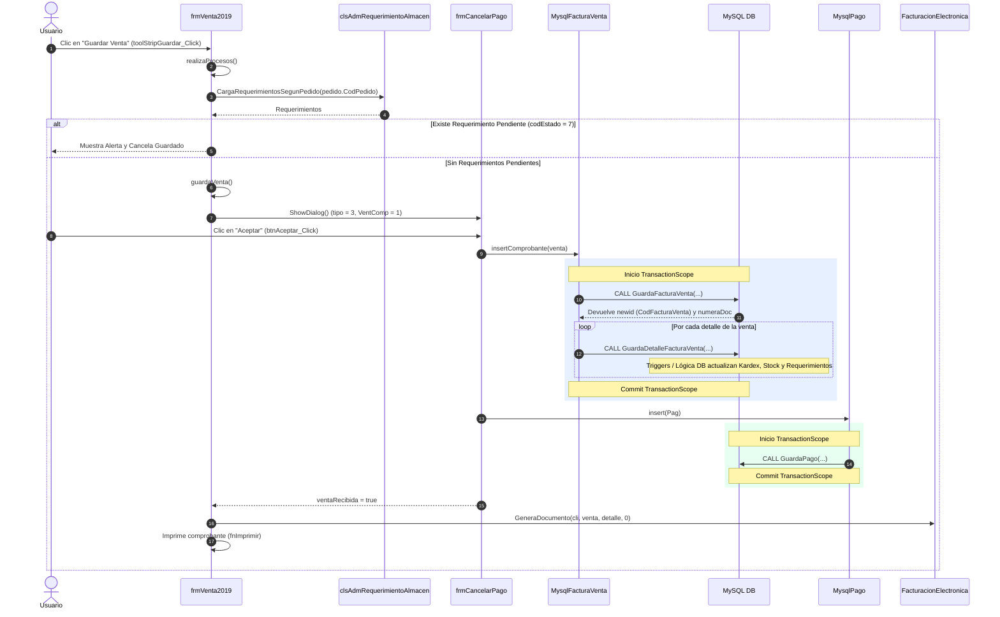

# Documentación del Proceso: Guardar y Terminar Venta en SIGEFA (`frmVenta2019`)

## 1. Visión General
Este documento describe en detalle el flujo completo de guardado y cobranza de una venta completa (al contado / no crédito) iniciada desde el formulario `frmVenta2019` en el sistema legacy SIGEFA.

El proceso abarca desde la acción del usuario en el Frontend WinForms, pasando por la lógica de negocio (`Administradores`), la capa de acceso a datos MySQL (`InterMySql`), hasta la ejecución de Stored Procedures, la validación de Requerimientos de Almacén, el impacto en Kardex/Stock, el registro de Pagos en Caja, el manejo de errores/rollbacks y la emisión electrónica hacia la SUNAT.

---

## 2. Flujo Secuencial Completo



---

## 3. Detalle Paso a Paso por Capas y Archivos

### 3.1. Frontend: `frmVenta2019.cs`

#### A. Evento `toolStripGuardar_Click` (Línea 2810)
1. Cambia el cursor a `Cursors.WaitCursor`.
2. Valida que el DataGrid de detalle `dgvdetalle` contenga productos (`RowCount > 0`).
3. Valida la categoría de cliente si aplica.
4. Si la opción `chbordencompra` está marcada, valida que `txtmontoordencompra` coincida exactamente con `txtPrecioVenta`.
5. Valida precios de venta y superValidator (`superValidator1.Validate()`).
6. Si pasa las validaciones, invoca a `realizaProcesos()`.

#### B. Método `realizaProcesos()` (Línea 2880)
1. Valida zona y técnico asignado (`validarZonaYTecnico()`).
2. **Si es un Pedido Nuevo (no guardado previamente)**:
   - Carga la numeración de Orden de Venta.
   - Llama a `AdmPedido.insertarOrdenVenta` (o `insertarOrdenVentaSinStock`).
   - Obtiene el `CodPedido`.
3. **Si es una Orden de Venta cargada (`cargaPedido`) y lista para Facturar/Cobrar**:
   - Consulta parámetros de límites mensuales de tickets si aplica (`SumTotalTickesMes`).
   - **Validación Crucial de Requerimientos de Almacén**:
     ```csharp
     DataTable dat_req = admreqalm.CargaRequerimientosSegunPedido(Convert.ToInt32(pedido.CodPedido));
     if (dat_req != null && verificarSiReqPendiente(dat_req))
     {
         MessageBox.Show("Tiene Requerimientos de Almacen Pendientes de Aprobacion", "Advertencia", MessageBoxButtons.OK, MessageBoxIcon.Exclamation);
         return;
     }
     ```
   - *Nota de Negocio:* Si existe al menos un requerimiento atado a la orden de venta cuyo `codEstado == 7` (Pendiente), la venta **NO se guarda** y el proceso se interrumpe.
   - Si no hay requerimientos pendientes, procede a invocar **`guardaVenta()`**.

#### C. Método `guardaVenta()` (Línea 3492)
1. Verifica línea de crédito disponible vs total en soles (si no es pago contado).
2. Agrupa los ítems por almacén (`codalmacen`), ya que una orden puede requerir atención desde múltiples almacenes.
3. Valida la apertura de caja para cada almacén involucrado mediante `AdmCaja.ValidarAperturaDia(...)`. Si alguna caja no está abierta, detiene el proceso.
4. Para cada almacén:
   - Construye la cabecera de la venta (`ArmaCabecera`).
   - Carga la serie activa correspondiente al tipo de documento y almacén (`AdmSerie.CargaSerieEmpresa`).
   - Valida correlatividad de fechas (`AdmVenta.FechaCorrelativoAnterior`).
   - Carga los detalles del comprobante (`RecorreDetalleVenta`).
   - Carga la forma de pago elegida (`fpago = AdmPago.CargaFormaPago`).
5. **Decisión Crédito vs Contado**:
   - **Si es Crédito (`fpago.Dias > 0`)**: Inserta directamente con `AdmVenta.insertComprobante(this.venta)`.
   - **Si es Contado (Pago Inmediato)**: Abre la ventana modal de cancelación de pago:
     ```csharp
     frmCancelarPago form = new frmCancelarPago();
     form.VentComp = 1;
     form.tipo = 3; // Cobranza Ventas
     form.CodCliente = cli.CodCliente;
     form.venta = this.venta;
     form.opcionSuma = 1;
     form.pagoventa = 1;
     form.ShowDialog();
     ```

---

### 3.2. Formulario de Pago y Cierre: `frmCancelarPago.cs`

#### A. Evento `btnAceptar_Click` (Línea 613)
1. Executa validaciones del formulario `superValidator1`.
2. Verifica si el comprobante ya fue registrado. Como `venta.CodFacturaVenta == null`, ejecuta primero el guardado de la venta:
   ```csharp
   if (!AdmVenta.insertComprobante(venta))
   {
       MessageBox.Show("EL PAGO NO SE HA REGISTRADO POR QUE LA VENTA NO SE GUARDO DE MANERA CORRECTA", ...);
       return;
   }
   ```
3. Si `insertComprobante` tuvo éxito, vuelve a cargar la venta con su nuevo ID (`AdmVenta.CargaFacturaVenta`).
4. Construye la estructura de Pago `clsPago Pag` asociando:
   - `CodNota` = `venta.CodFacturaVenta`
   - Formas/Métodos de pago (Efectivo, Tarjeta, Depósito/Operación, Cheque, Nota de Crédito).
   - Montos, Vueltos, Moneda, Tipo de Cambio, Caja Abierta ID (`Caja.Codcaja`).
5. Llama al método **`Pagar()`**.

#### B. Método `Pagar()` (Línea 1242)
1. Asigna el estado de aprobación del pago (`Pag.Aprobado = 4`).
2. Invoca el guardado del pago mediante `Admpag.insert(Pag)`.
3. Al finalizar correctamente, marca `ventaRecibida = true` y cierra el formulario.

---

## 4. Capa de Datos (MySQL) y Stored Procedures Invocados

### 4.1. Stored Procedure: `GuardaFacturaVenta`
* **Ubicación en Código:** `MysqlFacturaVenta.cs` (`insertComprobante`, Línea 141)
* **Propósito:** Insertar el encabezado de la venta en la base de datos y retornar el ID generado.
* **Parámetros Principales:**
  - `codSu`: ID Sucursal.
  - `codalma`: ID Almacén.
  - `codtran`: Tipo de Transacción (Venta Directa, Pedido, etc.).
  - `codtipo`: Tipo de Documento (1: Boleta, 2: Factura).
  - `codser`, `serie`, `numdoc`: Datos de serie y número correlativo.
  - `codcli`, `moneda`, `codlista`, `tipocambio`, `fechasalida`.
  - `bruto`, `montodscto`, `igv`, `total`, `pendiente`.
  - `formapago`, `fechapago`, `codven`, `codped`, `codusu`.
  - Parámetros de retención/ICBPER/Zona/Técnico.
* **Parámetros OUT:**
  - `newid` (OUTPUT): Devuelve el `CodFacturaVenta` autogenerado.
  - `numeraDoc` (OUTPUT): Devuelve el número correlativo final asignado.

### 4.2. Stored Procedure: `GuardaDetalleFacturaVenta`
* **Ubicación en Código:** `MysqlFacturaVenta.cs` (`insertComprobante`, Bucle en Línea 284)
* **Propósito:** Insertar cada ítem o producto vendido.
* **Parámetros Principales:**
  - `codpro`: Código de producto.
  - `codventa`: ID Venta (obtenido de `GuardaFacturaVenta`).
  - `codalma`, `unidad`, `serielote`, `cantidad`, `cantidadp`.
  - `moneda`, `precio`, `subtotal`, `dscto1`, `dscto2`, `montodscto`, `igv`, `importe`.
  - `codDetaPed`: ID del detalle del pedido de origen.
* **Parámetros OUT:**
  - `newid` (OUTPUT): Retorna el ID del detalle insertado. Retorna `-1` si **no hay stock suficiente** o si el requerimiento no cubre el stock necesario.
* **Lógica Interna en BD (Kardex y Requerimientos):**
  - Al ejecutarse este SP, los triggers/lógica en MySQL proceden a:
    1. Descontar el stock físico/disponible del Kardex de almacén.
    2. Actualizar las cantidades atendidas/pendientes en la orden de pedido y en el requerimiento de almacén correspondiente.

### 4.3. Stored Procedure: `GuardaPago`
* **Ubicación en Código:** `MysqlPago.cs` (`Insert`, Línea 23)
* **Propósito:** Registrar la transacción de cobro en caja.
* **Parámetros Principales:**
  - `codnot`: ID de la venta (`CodFacturaVenta`).
  - `codtipopago`: Método de Pago (Efectivo, Visa, Master, Depósito, etc.).
  - `codmon`, `codtar`, `tipo`, `ingegre`, `tipocambio`.
  - `montopa`: Monto pagado.
  - `montoco`: Monto cobrado.
  - `vuelto`, `mora`, `codalma`, `codcta`, `noperacion`, `ncheque`, `fecha`.
  - `codusu`, `codban`, `codcaja`.

---

## 5. Manejo de Errores, Transacciones y Rollback

1. **`TransactionScope` en `insertComprobante`**:
   - Si la inserción del detalle falla en algún ítem (ejemplo: `det.CodDetalleVenta == -1` por falta de stock), se invoca `Transaction.Current.Rollback()`.
   - Ningún detalle ni la cabecera quedan registrados en la base de datos.
2. **Captura de Excepción en `guardaVenta()` (`frmVenta2019.cs:3676`)**:
   - En caso de un fallo inesperado durante la generación de la venta:
   ```csharp
   catch (Exception ex)
   {
       foreach (clsFacturaVenta venta in lista_facturas)
       {
           if (venta.CodFacturaVenta != null && !AdmVenta.ValidaAnulacionVenta(...) && !AnulandoVentaEnTryCatchGeneracionVenta(venta))
           {
               MessageBox.Show("No se anulo la siguiente venta: ", ...);
           }
       }
       if (lista_facturas.Count != 0)
       {
           AdmPedido.activaPedidoVenta(Convert.ToInt32(lista_facturas[0].CodPedido));
       }
   }
   ```
   - Si la venta quedó a medio crear, se intenta anular y se reactiva el Pedido de Venta (`activaPedidoVenta`) para que no quede bloqueado ni consumido en el sistema.

---

## 6. Pasos Finales Post-Guardado

Una vez que la venta y el pago han finalizado en base de datos:
1. **Emisión de Comprobante Electrónico (SUNAT)**:
   - Se ejecuta de manera asíncrona: `await facturacion.GeneraDocumento(cli, this.venta, detalle1, 0);`.
   - Se genera el XML y el código QR del comprobante.
2. **Impresión del Comprobante**:
   - Recorre la lista de facturas generadas (`lista_facturas`) y llama a `fnImprimir(fv)`.
   - Renderiza la impresión mediante Crystal Reports (`CRReporteFactura.rpt` / `CRReporteBoleta.rpt`).
3. **Bloqueo del Formulario**:
   - Deshabilita los botones de guardado (`toolStripGuardar.Enabled = false`) para impedir doble emisión.

---

## 7. Resumen de Requisitos para Implementación en Nuevo Sistema

Si vas a migrar o reimplementar este proceso en una nueva arquitectura (ej. API Backend + SPA Frontend):

1. **Pre-requisito 1:** Validar estado de la Caja del Usuario (debe estar Abierta para el Almacén/Sucursal).
2. **Pre-requisito 2:** Validar Requerimientos de Almacén. Si la Orden de Venta posee requerimientos con estado `7` (Pendientes), rechazar la facturación.
3. **Paso 1 (BD Transaction):** Iniciar Transacción SQL.
4. **Paso 2 (BD SP):** Ejecutar `GuardaFacturaVenta` para obtener `CodFacturaVenta`.
5. **Paso 3 (BD SP):** Iterar e invocar `GuardaDetalleFacturaVenta` por cada ítem. Asegurar que los Triggers de BD o la lógica de negocio descuenten Kardex e inventario.
6. **Paso 4 (BD SP):** Ejecutar `GuardaPago` para registrar el cobro en Caja.
7. **Paso 5:** Commit Transacción SQL.
8. **Paso 6:** Invocar Servicio de Facturación Electrónica (SUNAT XML / SOAP).
